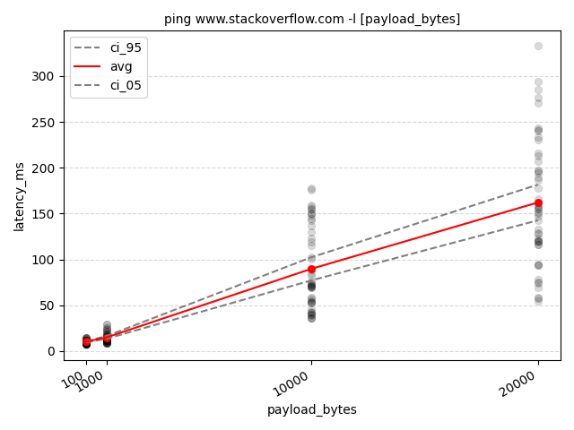
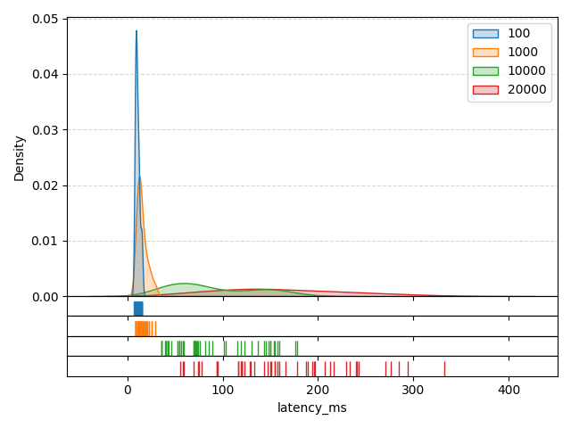
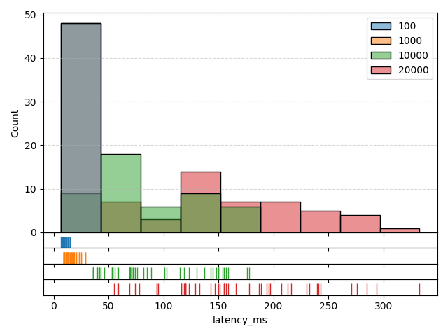
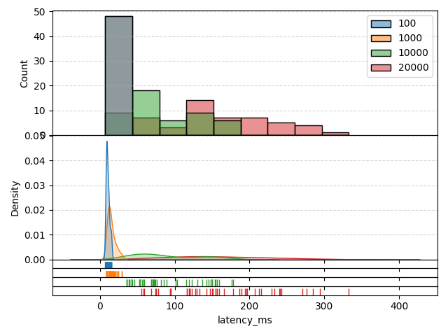

# GraphOut: A tool to capture, measure and plot printed data
Good for measuring performance or benchmarking, especially if all you can get your hands on is `print`.

### Install

```
pip install graphout
```

### Example

Execute ping 12 times using 6 parallel processes, parse the millisecond latency and make a graph.

```
graphout -n 12 --proc 6 --out ping_so -p 'latency_ms:time=([0-9]*)ms' --stack --rot-x -- ping www.stackoverflow.com -l [payload_bytes] -- 100 1000 10000 20000
         |--------------------------------- options --------------------------------|    |------------- command template ------------|    |----- values -----|
```

After running this, three things are going to happen:
1. The ping command is going to be run 12 times for each `[100, 1000, 10000, 20000]` value placed at `[payload_bytes]`
in the command template.
2. The output is going to be parsed line-by-line and a `time=([0-9]*)ms` regex applied to extract the latency.
3. The numeric results and some charts are going to be put into a folder named `ping_so`.

Each command configuration is going to contain up to 48 datapoints since each ping produces 4 measures, so `4 * 12 = 48`.
However, ping can sometimes time out so less than 48 datapoints is also possible.

#### Result: Graph



#### Result: Kernel Density Estimate (KDE)



#### Result: Histogram



#### Result: Histogram + KDE (Stacked)



Separate per-parameter-value KDEs and histograms are also generated.

#### Result: result.json

```
{
    "base": "ping www.stackoverflow.com -l [payload_bytes]",
    "runs": [
        {
            "command": "ping www.stackoverflow.com -l 100",
            "x_name": "payload_bytes",
            "x": "100",
            "measures": {
                "latency_ms": {
                    "stats": {
                        "cnt": 48,
                        "avg": 10.3125,
                        "std": 2.1846295756898293,
                        "min": 7.0,
                        "max": 15.0
                    },
                    "data": [
                        8.0,
                        8.0,
                        10.0,
                        10.0,
                        8.0,
                        9.0,
                        10.0,
                        14.0,
                        10.0,
                        11.0,
                        10.0,
                        14.0,
                        8.0,
                        11.0,
                        9.0,
                        13.0,
                        11.0,
                        9.0,
                        9.0,
                        8.0,
                        7.0,
                        9.0,
                        9.0,
                        9.0,
                        8.0,
                        9.0,
                        8.0,
                        9.0,
                        8.0,
                        12.0,
                        15.0,
                        11.0,
                        10.0,
                        9.0,
                        12.0,
                        12.0,
                        9.0,
                        12.0,
                        15.0,
                        11.0,
                        9.0,
                        12.0,
                        15.0,
                        9.0,
                        8.0,
                        12.0,
                        15.0,
                        11.0
                    ]
                }
            }
        },
        {
            "command": "ping www.stackoverflow.com -l 1000",
            "x_name": "payload_bytes",
            "x": "1000",
            "measures": {
                "latency_ms": {
                    "stats": {
                        "cnt": 48,
                        "avg": 15.0,
                        "std": 5.238970176536444,
                        "min": 9.0,
                        "max": 29.0
                    },
                    "data": [
                        9.0,
                        14.0,
                        21.0,
                        18.0,
                        12.0,
                        13.0,
                        12.0,
                        9.0,
                        9.0,
                        10.0,
                        18.0,
                        18.0,
                        11.0,
                        14.0,
                        16.0,
                        9.0,
                        9.0,
                        14.0,
                        13.0,
                        14.0,
                        9.0,
                        13.0,
                        14.0,
                        12.0,
                        13.0,
                        20.0,
                        29.0,
                        19.0,
                        11.0,
                        17.0,
                        25.0,
                        12.0,
                        13.0,
                        14.0,
                        29.0,
                        15.0,
                        13.0,
                        16.0,
                        21.0,
                        23.0,
                        11.0,
                        12.0,
                        25.0,
                        23.0,
                        10.0,
                        10.0,
                        16.0,
                        12.0
                    ]
                }
            }
        },
        {
            "command": "ping www.stackoverflow.com -l 10000",
            "x_name": "payload_bytes",
            "x": "10000",
            "measures": {
                "latency_ms": {
                    "stats": {
                        "cnt": 48,
                        "avg": 89.60416666666667,
                        "std": 44.4559258588957,
                        "min": 36.0,
                        "max": 178.0
                    },
                    "data": [
                        40.0,
                        70.0,
                        71.0,
                        69.0,
                        54.0,
                        36.0,
                        42.0,
                        43.0,
                        76.0,
                        130.0,
                        176.0,
                        85.0,
                        103.0,
                        74.0,
                        145.0,
                        115.0,
                        123.0,
                        101.0,
                        119.0,
                        143.0,
                        148.0,
                        155.0,
                        89.0,
                        178.0,
                        154.0,
                        39.0,
                        36.0,
                        40.0,
                        137.0,
                        72.0,
                        53.0,
                        58.0,
                        159.0,
                        53.0,
                        36.0,
                        42.0,
                        157.0,
                        82.0,
                        69.0,
                        70.0,
                        150.0,
                        59.0,
                        46.0,
                        56.0,
                        150.0,
                        73.0,
                        54.0,
                        71.0
                    ]
                }
            }
        },
        {
            "command": "ping www.stackoverflow.com -l 20000",
            "x_name": "payload_bytes",
            "x": "20000",
            "measures": {
                "latency_ms": {
                    "stats": {
                        "cnt": 48,
                        "avg": 162.10416666666666,
                        "std": 68.78682443834762,
                        "min": 55.0,
                        "max": 333.0
                    },
                    "data": [
                        78.0,
                        94.0,
                        94.0,
                        95.0,
                        133.0,
                        59.0,
                        55.0,
                        58.0,
                        187.0,
                        155.0,
                        120.0,
                        207.0,
                        240.0,
                        116.0,
                        196.0,
                        166.0,
                        285.0,
                        197.0,
                        159.0,
                        129.0,
                        333.0,
                        230.0,
                        216.0,
                        233.0,
                        213.0,
                        69.0,
                        74.0,
                        75.0,
                        241.0,
                        120.0,
                        119.0,
                        120.0,
                        243.0,
                        128.0,
                        123.0,
                        116.0,
                        271.0,
                        151.0,
                        147.0,
                        143.0,
                        276.0,
                        155.0,
                        157.0,
                        150.0,
                        294.0,
                        194.0,
                        189.0,
                        178.0
                    ]
                }
            }
        }
    ],
    "args": "-n 12 --proc 6 --out ping_measure -p latency_ms:time=([0-9]*)ms --stack --rot-x -- ping www.stackoverflow.com -l [payload_bytes] -- 100 1000 10000 20000"
}
```
